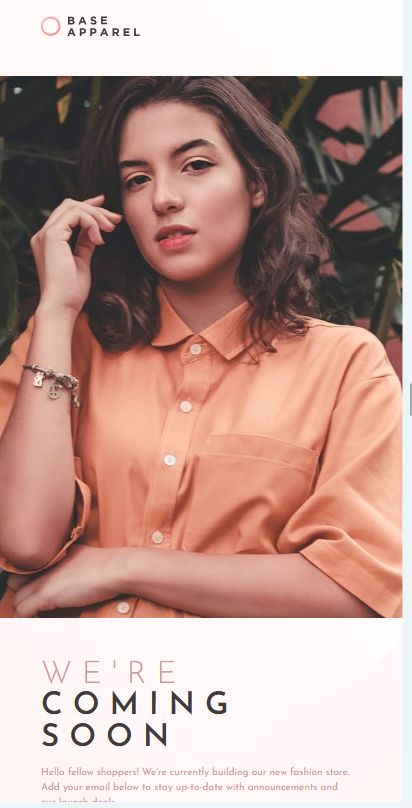

📦 Base Apparel Coming Soon Page — Frontend Mentor Challenge

This is my solution to the Base Apparel coming soon page challenge on Frontend Mentor
.
The challenge focuses on responsive layouts, form validation, and UI accuracy.

📸 Screenshot

🔗 Links

Live Site: https://your-live-site-link

Solution Page: https://your-frontend-mentor-solution

GitHub Repo: https://github.com/Sarahndom/Base-Apparel.git

🧰 Built With

Semantic HTML5

Modern CSS3

Grid

Flexbox

Custom properties (CSS variables)

Responsive design

JavaScript (email validation)

Mobile-first workflow

⚙️ Features

Users should be able to:

✔️ View the optimal layout depending on their device’s screen size
✔️ See hover and focus states for all interactive elements
✔️ Receive an error message when the form is submitted if:
    • The input field is empty
    • The email is not properly formatted

💻 What I Learned

How to position text and image sections using CSS Grid for desktop and column-reverse for mobile layouts.

How to overlay a button on an input using position: absolute.

How to perform simple email validation with JavaScript RegEx:

const validEmail = /^[^\s@]+@[^\s@]+\.[^\s@]+$/;

How to dynamically show/hide error messages using class toggling.

🔧 Useful Code Snippet

Email Validation + Error Handling:

submitBtn.addEventListener("click", function (e) {
    e.preventDefault();

    const email = emailInput.value.trim();
    const validEmail = /^[^\s@]+@[^\s@]+\.[^\s@]+$/;

    if (email === "" || !validEmail.test(email)) {
        emailInput.classList.add("error");
        errorMsg.classList.add("error-visible");
    } else {
        emailInput.classList.remove("error");
        errorMsg.classList.remove("error-visible");
        alert("Email submitted successfully!");
    }
});

🚀 Continued Development

In future projects, I want to improve at:

Perfect pixel matching with Figma/JPG designs

Writing more reusable CSS utility classes

Advanced form validation

Cleaner mobile navigation layouts

📚 Useful Resources

MDN – Email validation regex

CSS Tricks – Flexbox & Grid guides

Frontend Mentor community feedback

🙌 Acknowledgments

Thanks to Frontend Mentor for this great challenge and to everyone in the community providing feedback!